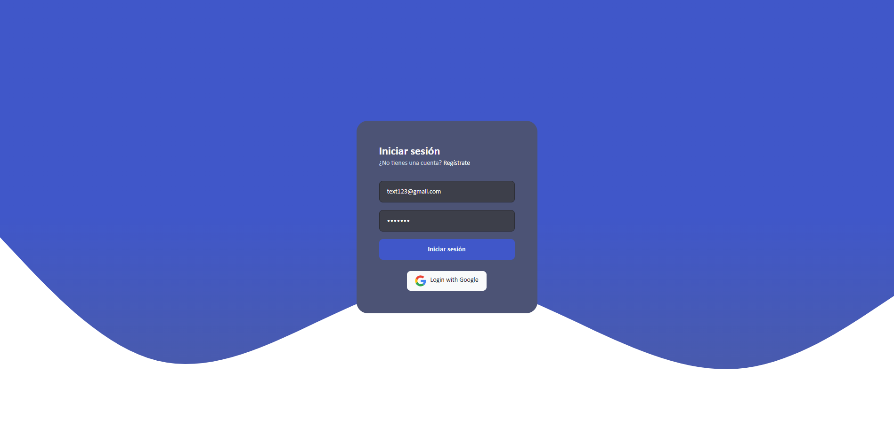
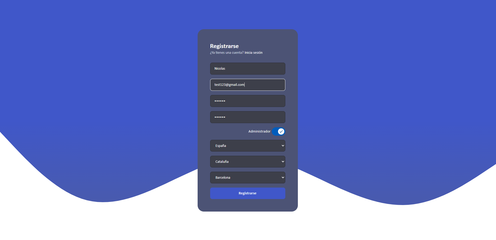
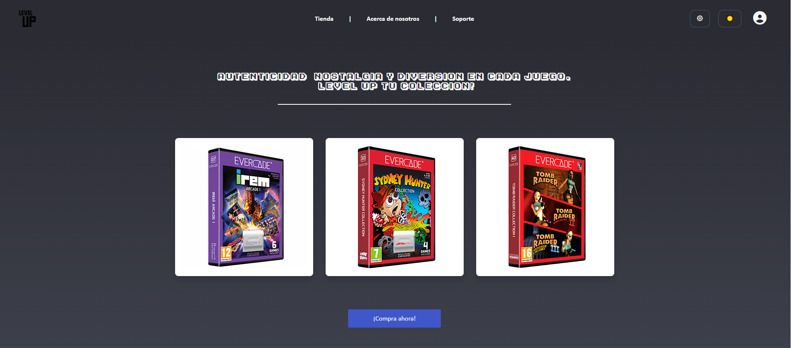
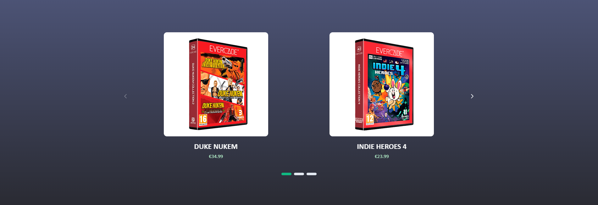
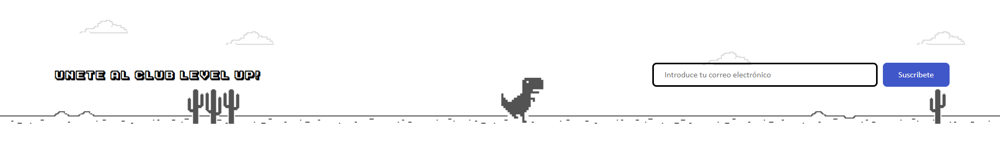
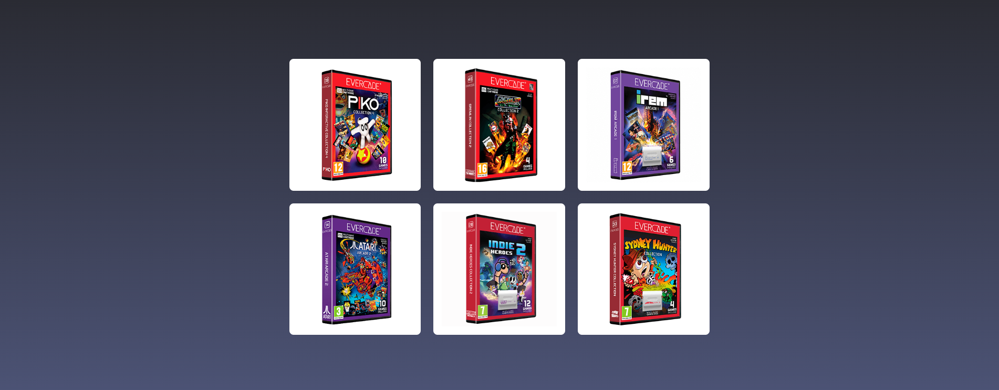
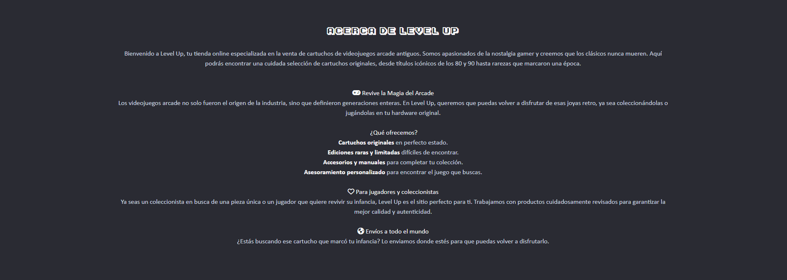
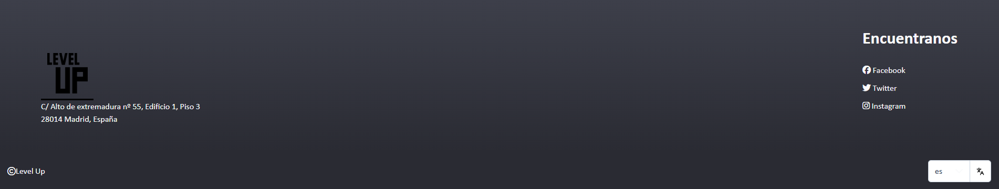
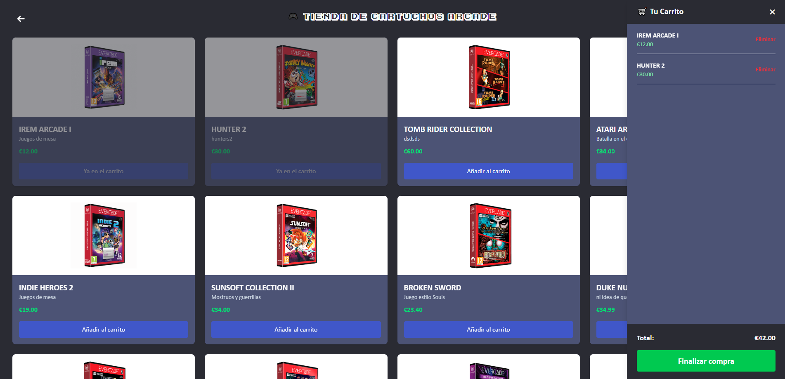
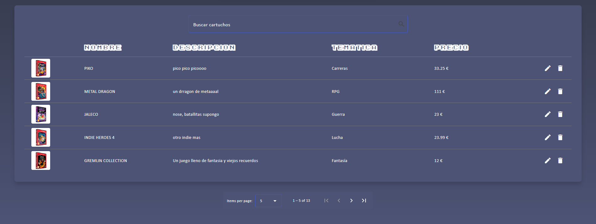

<p align="center">
  
</p>

<h1 align="center">🧠 LevelUp</h1>


**LevelUp** es una aplicación web de tipo SPA que combina Angular en el frontend y Node.js/Express en el backend para ofrecer una plataforma moderna y escalable de formación interactiva.

---

## 🧠 Descripción técnica

Desarrollo completo de una aplicación web SPA utilizando Angular y TypeScript, aplicando:

- ✔️ Buenas prácticas en la creación de componentes, servicios, directivas y pipes personalizados
- 🔐 Rutas protegidas con Lazy Loading, Guards, Resolvers e Interceptors
- 📋 Formularios reactivos con validaciones personalizadas
- ⚡ Gestión de estado con Signals
- 🛡️ Autenticación con JWT y Firebase (Admin SDK)
- 🎬 Animaciones modernas con `ViewTransitions`
- 🌍 Traducciones automáticas con `npx translate`
- 💄 Interfaz con **PrimeNG** y **Angular Material**

### 🔗 Backend Express

- 🌐 API REST con rutas protegidas
- 🔐 Middleware de autenticación con JWT
- 📧 Envío de correos con Nodemailer
- 📄 Documentación con Swagger
- 🔀 Conexión a bases de datos (ej: MongoDB)
- 💳 Pagos integrados con Stripe

---

## 📸 Capturas de pantalla

### 🔑 Autenticacion
Pantallas de login y registro, que muestran la interfaz limpia y validaciones de usuario para un acceso seguro.

- Implementacion de **JWT** para autenticación.
- **Firebase** para el login con Google.
- Implementacion de un servicio de carga para el boton de login.
  

- Utilizando **disabled** para deshabilitar los desplegables hasta que se complete el anterior desplegable.



---

### 🏠 Página de inicio  
- Todos los productos que se muestran se obtienen de la **API REST**.
- Hay un **darkmode**.
- Menu **responsive**, que se puede abrir y cerrar con un ícono de tres puntos.
  

- Carrousel de productos de **PrimeNG** obtenido de la API REST.
  

- Gestion de correos mediante **nodemailer**.
  

- Componente galeria de imagenes de **PrimeNG** obtenido de la API REST.
  

- Diseño responsive desplegable del acerca de la empresa.
  

- Footer estatico con un desplegable de **PrimeNG** con los idiomas disponibles gestioandos con `npx translate`.


---

### 💳 Tienda
- Interfaz de la tienda, integración con **Stripe** para pagos.
- Buena gestion del **localStorage** para guardar el estado de la aplicación.
- **Resolvers** para manejar que no se muestre el contenido hasta que no este completo con un **spinner** gestionado por un servicio con **RxJS** y **Señales**.
- Rutas hijas para la página de detalle de producto.


---

### 📚 Admin
- **Guards** para proteger las rutas.
- CRUD de productos con **PrimeNG** y **Angular Material**.
- Previsualizacion de imagenes.
- Paginacion controlada por la API REST.



---


## 🛠 Instalación local

```bash
# Clona el repo
git clone https://github.com/xNickqo/LevelUp.git
cd LevelUp

# Backend
cd back-end
cp .env.example .env
npm install
npm run dev

# Frontend (en otra terminal)
cd ../front-end
npm install
ng serve
```
