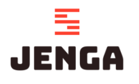

Proyecto base del departamento front-end. Es el punto de partida de cualquier nuevo proyecto. Puedes ver más información en la [documentación de Sharepoint](https://altengroup.sharepoint.com/sites/WebDepartment/SitePages/Jenga.aspx).

## Indice

- [Scripts NPM de utilidad](#scripts-npm-de-utilidad)
- [Entornos](#entornos)
- [Preinstall](#preinstall-y-schematics)
- [Arranque para desarrollo local](#arranque-para-desarrollo)
- [Docker](#docker)
- [Mocks](#mocks)

## Scripts NPM de utilidad

- `npm run test`: Ejecuta los tests de la app, y se queda en modo _watch_
- `npm run test:ci`: Ejecuta los tests una única vez (pensado para integración continua: jenkins)
- `npm run lint`: Ejecuta las comprobaciones del linter
- `npm run extract-translations`: Parsea el proyecto y extrae en `./src/assets/i18n` todas las keys de i18n que encuentre para los idiomas configurados
- `npm run release:first`: Ejecuta lo necesario para crear la _release_ inicial del proyecto, así como su `CHANGELOG.md`
- `npm run release:patch`: Crea una _release_ de tipo _patch_ (`v0.0.X`), aumentando la versión y modificando el `CHANGELOG.md` según corresponda.
- `npm run release:minor`: Crea una _release_ de tipo _minor_ (`v0.X.0`), aumentando la versión y modificando el `CHANGELOG.md` según corresponda.
- `npm run release:major`: Crea una _release_ de tipo _major_ (`vX.0.0`), aumentando la versión y modificando el `CHANGELOG.md` según corresponda.
- `npm run bundle:report`: Realiza un análisis de los bundles generados una vez _buildeado_ el proyecto, y lo presenta en el navegador. Para usar con entornos de DEV y PRE.

## Entornos

Los entornos disponibles para este proyecto son:

- `dev`: Entorno usado para montar una imagen docker con la aplicación a la que se le puede especificar la URL del API backend a la que atacar a través de la variable de entorno `API_BASE_URL` (muy útil si se utilizan contenedores docker)
- `pre`: Entorno de pre-producción. Generalmente será un entorno ALTEN
- `production`: Entorno de producción. Generalmente será un entorno de cliente

## Preinstall y Schematics

TODO

## Arranque para desarrollo

1. `npm install`
2. `npm start`\*
3. App en `http://localhost:4200/`

\*Si queremos hacer uso de OpenApi para mockear datos, podemos incluir en el package.json estas dos líneas:

```
  "prestart": "npm run generate:api",
  "prebuild": "npm run generate:api",
```

### Build tradicional

1. `npm install`
2. `npm run build -- --configuration=<entorno>`
3. Resultado compilado en: `./dist/jenga`

### Docker

1. `make build ENV=<entorno>`
2. Imagen creada: `webfront/jenga-<entorno>`

#### Correr imagen en contenedor

##NUEVO

```
docker build --build-arg ENV=production --build-arg APP=jenga -t jenga:latest .
docker run -d -it -p 8080:80 jenga:latest
```

http://localhost:8080

1. Crear el contenedor a partir de la imagen: `docker run -d -it -p 80:80/tcp jenga-<entorno> webfront/jenga-<entorno>:latest` (en lugar de `latest` puedes usar cualquier otra imagen tageada que tengas en tu sistema)
2. App en `http://localhost/`
3. A partir de ahí, si necesitas parar el contenedor: `docker stop jenga-<entorno>`
4. Si necesitas volver a arrancarlo nuevamente: `docker start jenga-<entorno>`

**Nota**: Solo para el entorno `dev` se permite recibir por variable de entorno (`API_BASE_URL`) la URL del backend donde se encuentra el API. Esta imagen es muy util si se quiere probar la app contra un backend propio: `docker run -d -it -p 80:80/tcp --env API_BASE_URL=http://localhost:8080/example/api --name jenga-dev webfront/jenga-dev:latest`

## Mocks

\*Si queremos hacer uso de OpenApi para mockear datos, podemos incluir en el package.json estas dos líneas:

```
  "prestart": "npm run generate:api",
  "prebuild": "npm run generate:api",
```

## Jenga Library (CHANGES)

**Nexus de SDOS obsoleto => usar Gitlab Npm Registry**

~~Las librerías de Jenga están publicadas en el siguiente [nexus](https://nexus.sdos.es/#), en caso de querer utilizar alguna de las [librerías publicadas en Jenga Library](https://gitlab.alten.es/web/stack/frontend/jengalibrary) se debe añadir un archivo ".npmrc" a la raíz de nuestro proyecto con el siguiente contenido [más información sobre nexus y cómo utilizarlo aquí](https://altengroup.sharepoint.com/sites/WebDepartment/SitePages/Reposito.aspx):~~

~~.npmrc:~~

```
DEPRECATED
  registry=https://nexus.sdos.es/repository/npm-delivery-group/
  //_auth=ZGVsaXZlcnktY2k6c2Rvc18xMDMw
```

~~Posteriormente en el package.json añadiremos la librería que queramos usar a nuestras dependencias:~~

~~package.json~~

```
DEPRECATED
  "@jenga/bread-crumbs": "X.X.X",
  "@jenga/custom-dialog": "X.X.X",
```

**Gitlab Npm Registry**

Las librerías de Jenga están disponibles a través del [Gitlab de Alten](https://gitlab.alten.es/web/stack/frontend/jengalibrary/-/packages), en caso de querer usar alguna de las [liberías publicadas en Jenga Library](https://gitlab.alten.es/web/stack/frontend/jengalibrary) se debe verificar que tenemos el fihero ".npmrc" en la raíz de nuestro proyecto y que contiene lo siguiente:

.npmrc:

```
@frontend:registry=https://gitlab.alten.es/api/v4/packages/npm/
@frontend:registry=https://gitlab.alten.es/api/v4/projects/364/packages/npm/
//gitlab.alten.es/api/v4/packages/npm/:_authToken="${NPM_TOKEN}"
```

Después deberemos crear una variable de entorno en nuestro sistema que se llame "NPM_TOKEN" y asignarle un token que de acceso a la lectura de paquetes del [proyecto de Jenga Library](https://gitlab.alten.es/web/stack/frontend/jengalibrary/-/settings/access_tokens). Más información de cómo crear un token en el siguiente [enlace](https://altengroup.sharepoint.com/sites/WebDepartment/SitePages/Publicar-un.aspx). En caso de no tener permisos para crear un token ponte en contacto con el equipo frontend del departamento Web de Alten.

Posteriormente en el package.json añadiremos la librería que queramos usar a nuestras dependencias:

package.json

```
  "@frontend/bread-crumbs": "X.X.X",
  "@frontend/custom-dialog": "X.X.X",
```

\*Consulta las [versiones disponibles aquí.](https://gitlab.alten.es/web/stack/frontend/jengalibrary/-/packages)

También puedes instalarlas por línea de comandos:

```
  npm i @frontend/custom-dialog@X.X.X
```

## Context Roots

En caso de que necesitemos que nuestra aplicación esté desplegada con un context root específico debemos:

1. Añadir un nuevo atributo "assetsPath: string;" a "src\app\core\types\env.ts".
2. Definir en las variables de entorno la nueva variable "assetsPath" cuyo valor corresponda al del context root. Ejemplo: "assetsPath: '/ContextRoot'"
3. Utilizar la nueva variable de entorno en el constructor del factory "src\app\core\locale\translate-loader.factory.ts", modificando el prefijo que espera el constructor de la siguiente forma "public prefix: string = `${environment.assetsPath}/assets/i18n/`" e importando las variables de entorno.
4. Modificar el archivo "angular.json" añadiendo el context root de la siguiente forma:

```
{
    "projects": {
        "Jenga_Front": {
            "architect": {
                "build": {
                    "options": {
                        "outputPath": "dist/ContextRoot",
                        "deployUrl": "/ContextRoot/",
                        "baseHref": "/ContextRoot/",

```

5. Por último se tendrá que revisar el código para asegurarnos que no se esté utilizando ninguna ruta absoluta que apunte directamente a la carpeta assets. Ejemplos:

```
  .forgot-password-image {
    // Esta línea hay que reemplazarla
    // background: url(/assets/img/login-img@2x.jpg) no-repeat;
    background: url(../../../../../../assets/img/login-img@2x.jpg) no-repeat;
    background-size: cover;
  }
```

```
@font-face {
  font-family: 'jenga';
  // Líneas a modificar
  //src: url('/assets/fonts/jenga.eot?z9bjzz');
  //src: url('/assets/fonts/jenga.eot?z9bjzz#iefix') format('embedded-opentype'),
  //  url('/assets/fonts/jenga.ttf?z9bjzz') format('truetype'), url('/assets/fonts/jenga.woff?z9bjzz') format('woff'),
  //  url('/assets/fonts/jenga.svg?z9bjzz#jenga') format('svg');
  ///////////////////////////////////////////////////////////
  src: url('../assets/fonts/jenga.eot?z9bjzz');
  src: url('../assets/fonts/jenga.eot?z9bjzz#iefix') format('embedded-opentype'),
    url('../assets/fonts/jenga.ttf?z9bjzz') format('truetype'), url('../assets/fonts/jenga.woff?z9bjzz') format('woff'),
    url('../assets/fonts/jenga.svg?z9bjzz#jenga') format('svg');
}
```

```
//
<img src="./
```

## PWA - Service workers

Se han añadido las características de una PWA al stack tecnológico de Jenga. Para más información puedes cosultar la documentación oficial de [Angular Service Workers/PWA](https://angular.io/guide/service-worker-getting-started).

El uso de PWA en nuestra aplicación no es obligatorio y se puede deshabilitar facilmente a través del archivo angular.json seteando el atributo "serviceWorker" a false.

Por otro lado, se ha configurado el archivo "ngsw-config.json" para que cachee solo los archivos de la propia aplicación, los que se encuentran en la carpeta assets y las fuentes que se carguen a través de "https://fonts.googleapis.com/*", "https://fonts.gstatic.com/*".

Se puede añadir una configuración extra en el archivo "ngsw-config.json" para cachear también las peticiones get que se lancen a back.

```
{
    "$schema": "./node_modules/@angular/service-worker/config/schema.json",
    "index": "/index.html",
    "dataGroups": [
        {
            "name": "api",
            "urls": ["/api/**"],
            "cacheConfig": {
                "strategy": "freshness",
                "maxSize": 100,
                "maxAge": "5d",
                "timeout": "2s"
            }
        }
    ],
    "assetGroups": [
      ...
    ]
}
```

[Aquí puedes ver más información sobre la configuración del service worker](https://angular.io/guide/service-worker-config)

Puesto que uno de los [requísitos mínimos](https://angular.io/guide/service-worker-intro#prerequisites) para que una PWA funcione correctamente es que la aplicación se acceda a través de https (existe una excepción que es acceder a través de localhost) y que la aplicación esté en modo producción; se ha añadido un script en el package.json que realiza el build con el entorno de PRE (para que el flag production sea true) y levanta la aplicación en http://localhost:8080.

```
  npm run start-pwa
```
